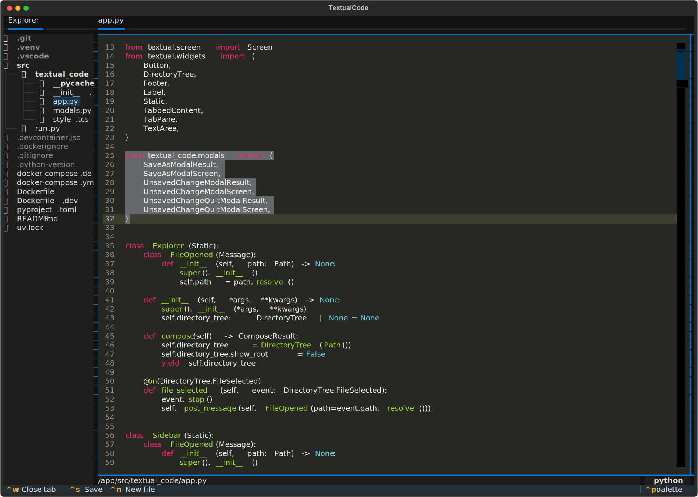

Textual Code
============

Code editor for who don't know how to use vi



> [!WARNING]  
> This project is in the early stages of development.
> It is not ready for use yet.

## TODO

- [ ] Explore files
    - [x] Show the files in the sidebar
    - [ ] Open a specific folder from the command palette
    - [ ] Open a specific folder from command arguments
- [ ] Create
    - [ ] Create a new file from the sidebar
    - [ ] Create a new file from the command palette
    - [ ] Create a new folder from the sidebar
    - [ ] Create a new folder from the command palette
- [ ] Open file
    - [x] Open a specific file from the sidebar
    - [x] Open files to tabs
    - [x] Open new file from the command palette
    - [x] Open new file from shortcut
    - [ ] Open a specific file from the command palette
    - [ ] Open a specific file from command arguments
- [ ] Save file
    - [x] Save the current file
    - [x] Save as the current file
    - [x] Save the current file from shortcut
    - [x] Save the current file from the command palette
    - [ ] Save all files
- [ ] Close file
    - [x] Close the current file
    - [x] Close the current file from shortcut
    - [x] Close the current file from the command palette
    - [x] Ask to save the file before closing
    - [ ] Close all files
- [ ] Delete
    - [x] Delete the current file
    - [x] Delete the current file from the command palette
    - [ ] Delete a specific file from the sidebar
    - [ ] Delete a specific file from the command palette
    - [ ] Delete a specific folder from the sidebar
    - [ ] Delete a specific folder from the command palette
    - [x] Ask to confirm before deleting
- [ ] Edit file
    - [x] Basic text editing
    - [ ] Multiple cursors
    - [ ] Code completion
    - [ ] Syntax highlighting
        - [x] Detect the language from the file extension
        - [ ] Change the language
        - [ ] Add more languages
    - [ ] Change Indentation size and style
    - [ ] Change line ending
    - [ ] Change encoding
    - [ ] Show line and column numbers
    - [ ] Goto line and column 
- [ ] Search and replace
    - [ ] Plain Search
    - [ ] Regex search
    - [ ] Replace all
    - [ ] Select all occurrences
    - [ ] In the current file
    - [ ] In all files
- [ ] Markdown preview
    - [ ] Show the markdown preview
    - [ ] Live preview
- [ ] Split view
    - [ ] Split the view horizontally
    - [ ] Split the view vertically
    - [ ] Close the split view
    - [ ] Resize the split view
    - [ ] Move the focus to the split view
    - [ ] Move tabs between split views
- [ ] Sidebar
    - [x] Show the sidebar
    - [ ] Hide the sidebar
    - [ ] Resize the sidebar
- [ ] Setting
    - [ ] Themes
        - [ ] UI
        - [ ] Syntax highlighting
    - [ ] Shortcuts
    - [ ] Editor
        - [ ] default indentation size and style
        - [ ] default line ending
        - [ ] default encoding
- [ ] Etc
    - [ ] Support EditorConfig

## Usage

```bash
docker compose build app
docker compose run --rm app
```

## Development

(You need to use devcontainer to run the code)

To open the textual console, run the following command:

```bash
uv run textual console
```

Then, you can run the following command to run the code:

```bash
uv run textual run --dev src/run.py
```