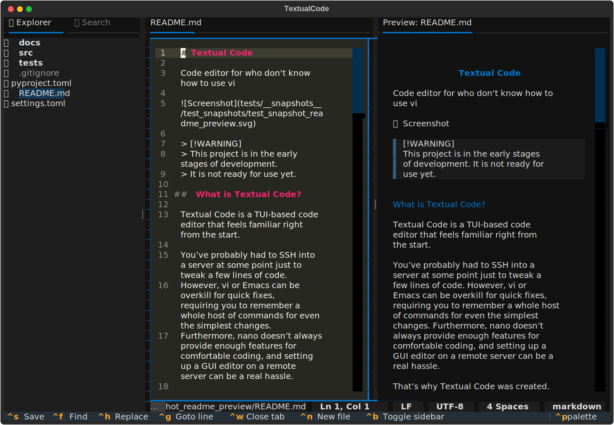

# Textual Code

Code editor for who don't know how to use vi



> [!WARNING]  
> This project is in the early stages of development.
> It is not ready for use yet.

## What is Textual Code?

Textual Code is a TUI-based code editor that feels familiar right from the start.

You’ve probably had to SSH into a server at some point just to tweak a few lines of code.
However, vi or Emacs can be overkill for quick fixes, requiring you to remember a whole host of commands for even the simplest changes.
Furthermore, nano doesn’t always provide enough features for comfortable coding, and setting up a GUI editor on a remote server can be a real hassle.

That’s why Textual Code was created.
You likely use a GUI editor like VS Code or Sublime Text in your day-to-day work, and Textual Code offers a similar experience with no learning curve.
It behaves much like any other code editor you’re used to.

We’re not asking you to switch to Textual Code as your main editor.
Just remember it’s there when you need to jump onto a server and make a few quick edits.
It’s that simple.

## Features

- Commonly used shortcuts, such as `Ctrl+S` to save and `Ctrl+F` to search
- Command palette for quick access to all features, and no need to remember shortcuts
- Multiple cursors
- Mouse support
- Find and replace from workspace
- Explore files in the sidebar
- Open files to tabs
- Syntax highlighting
- Image file preview in the terminal

## Installation

> [!TIP]
> We recommend using `uv` for installation and management.

```bash
# Using pip
pip install textual-code

# Using uv (recommended)
uv tool install textual-code

# Run without installing
uvx textual-code
```

## Usage

To open the textual code, run the following command in your workspace:

```bash
textual-code
```

## Troubleshooting

### Keyboard shortcuts not working

Some terminal emulators intercept certain key combinations before they reach the application.
If a shortcut does not work as expected, run the following command and press the shortcut to verify that your terminal recognizes it:

> [!TIP]
> We recommend using `uvx` as it requires no separate installation.

```bash
# Using pip
pip install textual-dev
textual keys

# Run without installing (recommended)
uvx --from textual-dev textual keys
```

## Development

(You need to use devcontainer to run the code)

To run the development version directly:

```bash
uv run textual-code
```

To run with the Textual dev console (shows logs and events), open two terminals:

```bash
# Terminal 1: start the console
uv run textual console

# Terminal 2: run the app in dev mode
uv run textual run --dev textual_code:main
```

### Installing Hooks

Install pre-commit hooks to automatically run linting, formatting, type checking, and language checks before each commit:

```bash
uv run pre-commit install
```

### Running Tests

See [docs/testing-guide.md](docs/testing-guide.md) for patterns, best practices, and gotchas.

```bash
# Unit/integration tests — parallel (~2.5 min)
uv run pytest tests/ -n $(( $(nproc) * 2 )) -m "not serial"

# Snapshot tests — must run serially
uv run pytest tests/ -m serial

# Update snapshots after UI changes
uv run pytest tests/snapshots/test_snapshots.py --snapshot-update

# Single file
uv run pytest tests/editor/test_code_editor.py
```
